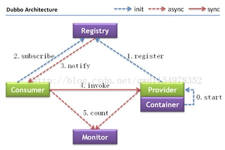

此项目为demo-dubbo : 加入service-api之后此项目为Dubbo的provider

学习dubbo相关知识

重要的两点是：@Service 和 @Reference  (注意引入alibaba的相关包，不能是其他的)

    service-api使用流程：
        1）api定义
        定义request和response类型，其实一定程度上替代了Entity层。
        定义interface
        定义完执行mvn install
        在dubbo服务中引入相关mvn依赖
        2）service实现
        在服务端实现api定义的接口，并将服务做成dubbo服务
        使用@Service(version="")
        3）其他服务使用
        使用@reference(version="")
     

1、application.properties配置：

    #dubbo相关配置
    
    #dubbo提供者的别名，只是个标识
    spring.dubbo.application.name=provider
    #zk地址
    dubbo.registry.address=zookeeper://127.0.0.1:8801
    #dubbo协议
    dubbo.protocol.name=dubbo
    #duboo端口号
    dubbo.protocol.port=12345
    #这是你要发布到dubbo的接口所在包位置
    dubbo.scan=test.spring.dubboService
  
2、引入maven依赖：

    <!--dubbo依賴包-->
            <dependency>
                <groupId>io.dubbo.springboot</groupId>
                <artifactId>spring-boot-starter-dubbo</artifactId>
                <version>1.0.0</version>
            </dependency>
            
3、原理：

    
    节点角色说明：Provider: 暴露服务的服务提供方。Consumer: 调用远程服务的服务消费方。Registry: 服务注册与发现的注册中心。Monitor: 统计服务的调用次调和调用时间的监控中心。Container: 服务运行容器。
    
    调用关系说明：
    0. 服务容器负责启动，加载，运行服务提供者。
    1. 服务提供者在启动时，向注册中心注册自己提供的服务。
    2. 服务消费者在启动时，向注册中心订阅自己所需的服务。
    3. 注册中心返回服务提供者地址列表给消费者，如果有变更，注册中心将基于长连接推送变更数据给消费者。
    4. 服务消费者，从提供者地址列表中，基于软负载均衡算法，选一台提供者进行调用，如果调用失败，再选另一台调用。
    5. 服务消费者和提供者，在内存中累计调用次数和调用时间，定时每分钟发送一次统计数据到监控中心。
    
    Consumer服务消费者，Provider服务提供者。Container服务容器。消费当然是invoke提供者了，invoke这条实线按照图上的说明当然同步的意思了，多说一句，在实际调用过程中，Provider的位置对于Consumer来说是透明的，上一次调用服务的位置（IP地址）和下一次调用服务的位置，是不确定的。这个地方就是实现了软负载。
    服务提供者先启动start，然后注册register服务。
    消费订阅subscribe服务，如果没有订阅到自己想获得的服务，它会不断的尝试订阅。新的服务注册到注册中心以后，注册中心会将这些服务通过notify到消费者。
    Monitor这是一个监控，图中虚线表明Consumer 和Provider通过异步的方式发送消息至Monitor，Consumer和Provider会将信息存放在本地磁盘，平均1min会发送一次信息。Monitor在整个架构中是可选的（图中的虚线并不是可选的意思），Monitor功能需要单独配置，不配置或者配置以后，Monitor挂掉并不会影响服务的调用。
 
4、测试说明

    详见service层的DubboDemoService.java 和 TestDemoDubboService.java